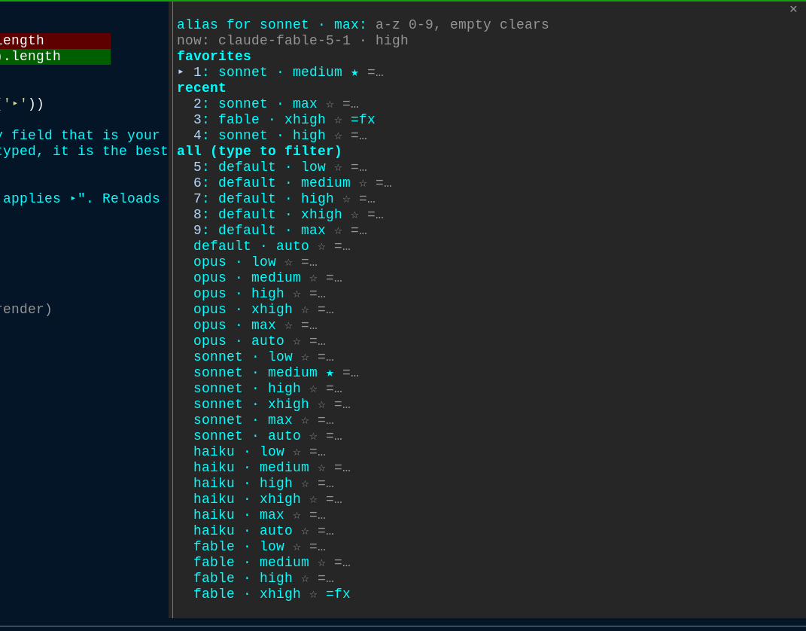

# model-pick

Switch Claude Code's **model and effort in one go**, from a fuzzy-search pane.
Type a few letters, press Enter. Favorite the combos you use most, give them
short aliases, and the last 5 picks stay one keystroke away.



## Install

In any Claude Code session:

```
/plugin install model-pick --marketplace joshuatonga/claude-mods
```

Answer `y` to add the marketplace, then pick a scope (user is fine). That is
all: `/pick` works in that session right away and in every session after.

Already added the marketplace? Then it is just:

```
/plugin install model-pick@claude-mods
```

Needs Claude Code 2.1.292 or newer (the mod is a function-hooks plugin).

## Use

Open the picker with `/pick`. The cursor lands in the search field.

| Type | Then | Result |
| --- | --- | --- |
| `op hi` | Enter | switches to **opus · high** (runs `/model opus`, then `/effort high`) |
| nothing | Enter | applies the first row: your first favorite, else the newest recent |
| `*son max` | Enter | stars / unstars **sonnet · max** as a favorite |
| `=fx fable xhigh` | Enter | gives **fable · xhigh** the alias `fx` |
| `fx` | Enter | applies the aliased combo (an alias always beats a fuzzy match) |
| `3` | Enter | applies row 3 of the list |
| `op hi 2` | Enter | applies the 2nd match for `op hi` |
| | Esc | closes the pane |

The `▸` marks the row Enter will apply. The numbers `1:` to `9:` are row
numbers: type one (alone, or after your query) to move `▸` to that row. They
also work as hotkeys once Tab moves the focus off the search field.

Each row has three buttons: the combo itself, `☆` / `★` to toggle favorite,
and `=…` to type an alias for that row. Tab reaches them; Enter presses.

With an empty search the pane lists **favorites** first, then the **5 most
recent** picks, then every combo.

### Open it with a key

Claude Code keybindings can run a slash command. Add this to
`~/.claude/keybindings.json` (run `/keybindings` to create the file) and
Alt+M (Option+M on macOS) opens the picker:

```json
{
  "bindings": [
    { "context": "Chat", "bindings": { "meta+m": "command:pick" } }
  ]
}
```

Any chord works, for example `"ctrl+x m"`. The binding takes no arguments,
so it always opens the pane; aliases are for the pane or `/pick <alias>`.

### Without opening the pane

```
/pick fx          applies the alias fx
/pick son max     applies the best fuzzy match
```

If Claude Code asks you to confirm the model switch and you decline, nothing
changes and nothing is recorded: the toast says "not applied".

Favorites, aliases and recents are saved in the plugin's store and survive
restarts.

## Models and efforts offered

Models: `default`, `opus`, `sonnet`, `haiku`, `fable`, `opusplan`, and their
`[1m]` variants. Efforts: `low`, `medium`, `high`, `xhigh`, `max`, `auto`.

A model your account cannot use is still listed; picking it makes `/model`
answer "Kept model as …" and the mod reports "not applied".

Model ids your settings name are added automatically: the `availableModels`
allowlist and your default `model` in `settings.json`. That covers Bedrock and
Vertex ids and any alias newer than this list. Nothing to configure.

## Hacking on it

```
git clone git@github.com:joshuatonga/claude-mods.git
claude --plugin-dir ./claude-mods/model-pick     # load it for one session; edits hot-reload
claude plugin validate ./claude-mods/model-pick
claude plugin test ./claude-mods/model-pick
```

Layout:

- `hooks/register.tsx` — the hooks module: the `/pick` command, the pane, the apply logic
- `hooks/fuzzy.ts` — the matcher and the combo list
- `types/index.d.ts` — the plugin's state contract
- `tests/` — run with `claude plugin test`
